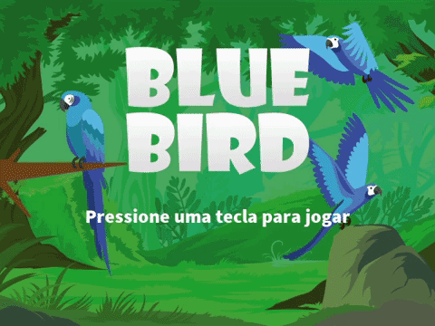

# BLUEBIRD


## | Sobre
Com o objetivo de retratar o tráfico de animais, o jogo Bluebird traz uma atmosfera de fuga de uma Arara-Azul de protagonista, espécie ameaçada de extinção, tendo que escapar das gaiolas dos contrabandistas.
Através de um cenário tropical o usuário terá que utilizar do atalho de espaço do teclado para desviar das gaiolas colocadas pelos vilões. O jogo além de concientizar os jogadores, traz para essa experiência única de aventura.

## | Características
- TELA INICIAL
- TECLA DE ACESSO ESPAÇO;
- CONTAGEM DE PONTOS
- COLISÃO COM AS GAIOLAS E CHÃO
- TELA DE GAME OVER QUE MOSTRA O SCORE
- EFEITOS SONOROS GENÉRICOS;
- DESIGN AUTORAL MODIFICADO;

## | Integrantes
- Ana Larissa;
- Caymi Ferreira;
- Rayanne Fidelis;
- Luis Gustavo;
- Hebert Ivisson;

## | Guia de instalação
Crie um fork do repositório e vá até o diretório na sua máquina em que você deseja colocar o repositório e digite no terminal:
```
git clone https://github.com/gustavoataidez/game-bluebird.git
```
Logo em seguida o repositório do jogo já estará clonado no seu computador.


## | Como contribuir
Recomenda-se criar um branch para manter as suas alterações separadas
```
git checkout -b nome_do_novo_branch
```
Agora você pode alterar o projeto sem qualquer dano ao repositório original.
Depois de feitas todas as alterações necessárias e commits, você provavelmente desejará enviá-las para o seu repositório remoto e para repositório original (já que a sua ideia é contribuir).
Escreva sua mensagem e clique em create pull request.

## | Tecnologias utilizadas
<div style="display: inline_block"><br>
  
  
  
</div>
